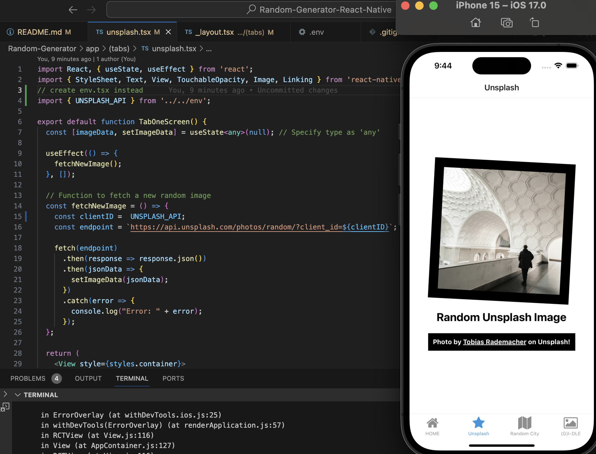
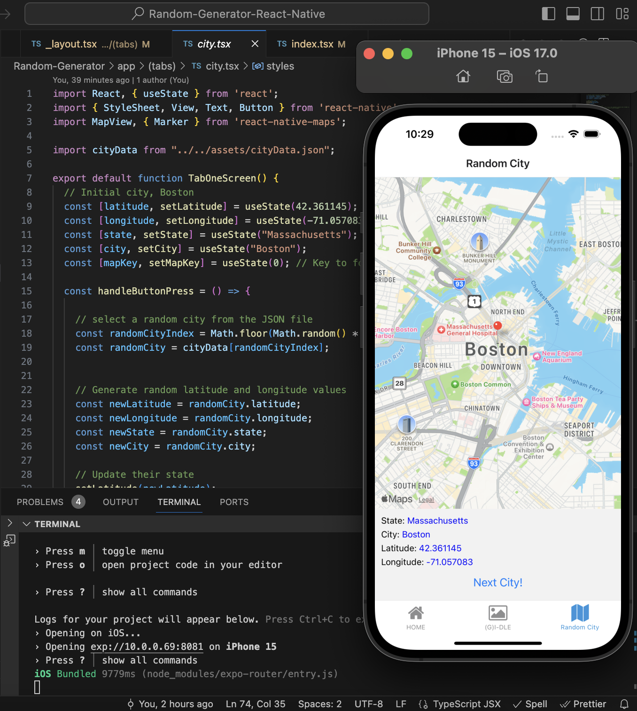
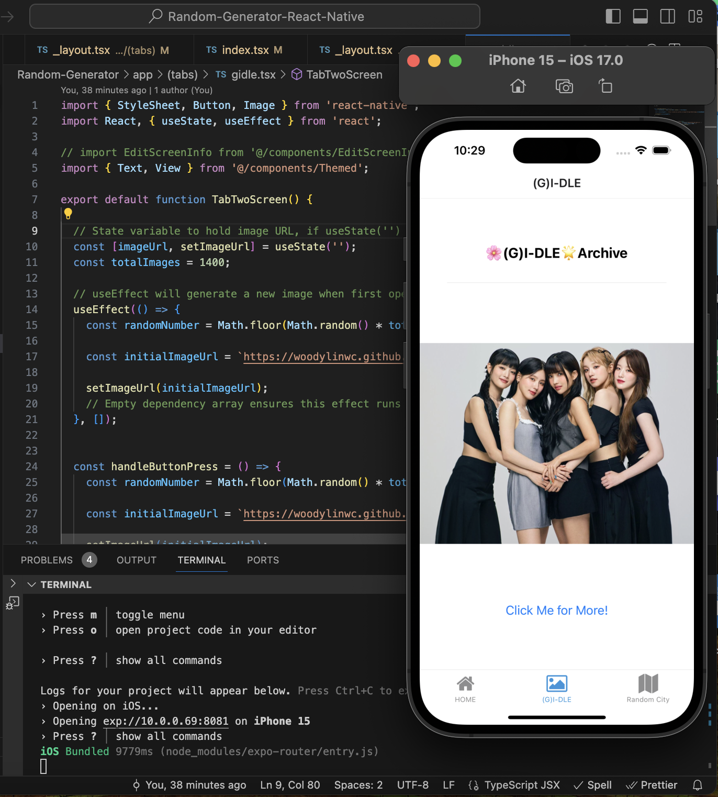
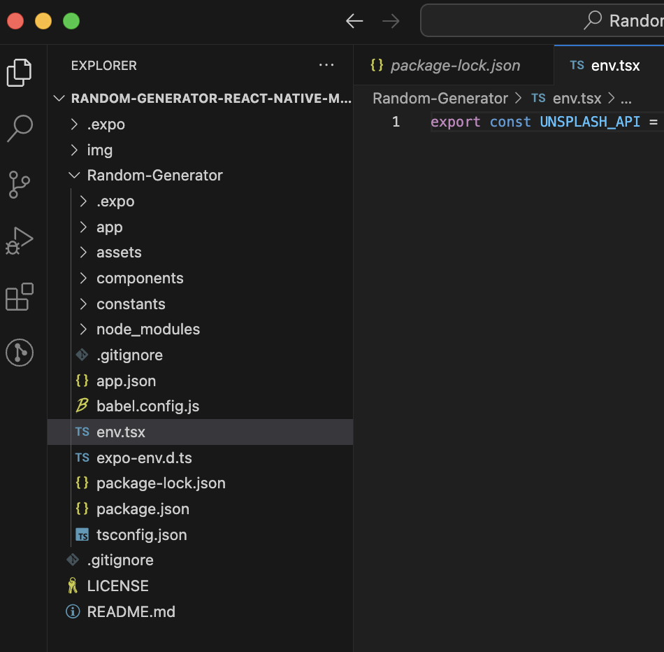
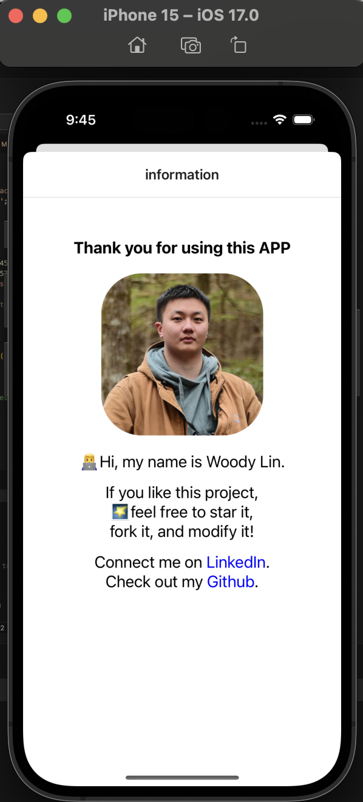

# Random-Generator-React-Native

An intuitive and fun project that helps you understand a little bit about React Router and React Hooks (useState, useEffect) by showing you three ways of getting and displaying data.

1. Online API (Unsplash API)
2. Local JSON file (cityData.json)
3. GitHub Page (My GitHub image storage)





# How to run this project locally
**Fork** my repo and give it a shot!
```
cd Random-Generator
npm install

// please create a env.tsx file 
// and obtain access key from Unsplash before run the application

npx expo start
// open your iOS simulator on Xcode
i
```

You create your `env.tsx` file in the following place
```
export const UNSPLASH_API = "YOUR_UNSPLASH_ACCESS_KEY"
```



In Unsplash page, you can click the image to get next one.

In Random City page, you can click "Next City!" to visit next city.

In (G)I-DLE page, you can click "Click Me for More!" to generate new one.


# Expo Router
Expo Router is a file-based router for **React Native** and web applications. It allows you to manage navigation between screens in your app, allowing users to move seamlessly between different parts of your app's UI, using the same components on multiple platforms (Android, iOS, and web).

If you want to make a similar project on your own, you can use the Expo Router template.

[Install Expo Router](https://docs.expo.dev/router/installation/#quick-start)
```
npx create-expo-app@latest --template tabs@50
npx expo start
```

# React Hook

In this project, if you don't use a state variable to hold the image URL, the image won't be able to dynamically change based on user interaction or any other events. Instead, the image will be static and remain the same throughout the component's lifecycle.

Please check [here](https://legacy.reactjs.org/docs/hooks-intro.html) to learn more about React Hook.


# Unsplash API

The Unsplash API is a modern JSON API. It allows you to search and obtain high-resolution copyright-free images

Go to https://unsplash.com/developers to request FREE API access key!

# React Native Version
```
"react-native": "0.73.6"
```


# Project Author
I have tested my project separately, and it worked. Let me know if there's any problem.

My email: wancheng.lin001@gmail.com

